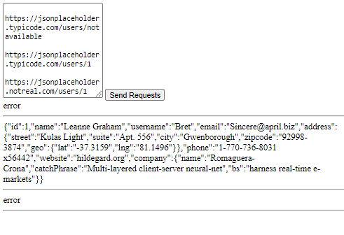

# Requester

Create a requester which gets multiple requests and show the results in order.

## Details

- The requests are inserted in a textarea and are separated by space or newline or any combination of them.

- The requests are processed in order and the responses are displayed as soon as they are received.

- The requests are sent async.

- Print 'error' if the request failed.

## Preview

